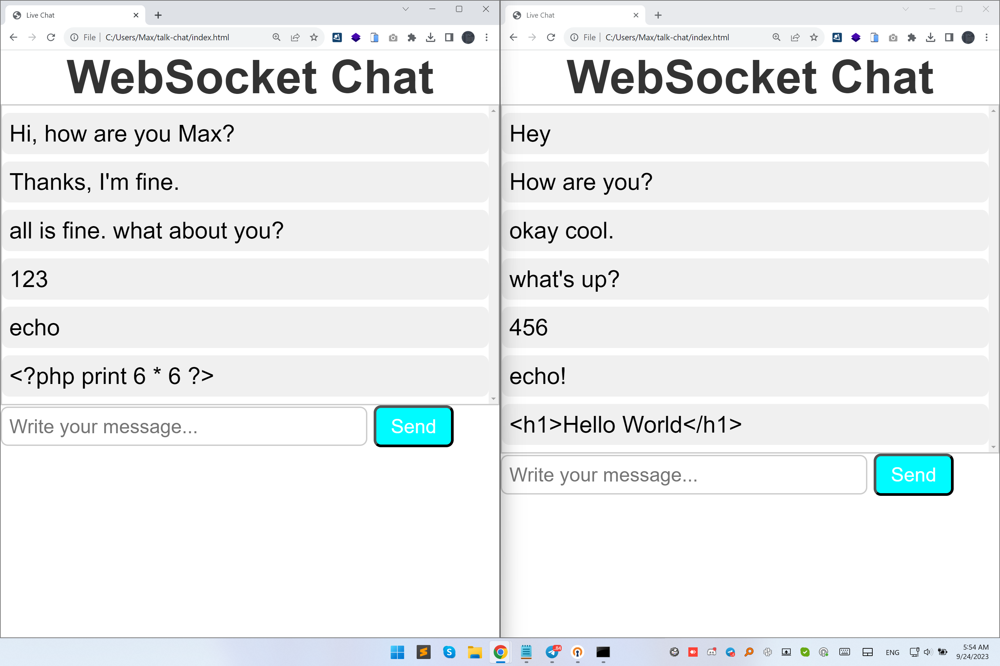

# "Building a WebSocket Server and Client: Live Coding with Node.js and JavaScript"

In this session, we'll dive deep into the world of WebSocket technology and its transformative potential for real-time communication in web applications.
Let's begin by understanding why this topic matters in today's digital landscape and explore the agenda for our journey.



### JavaScript Global Summit 2023

```
node server.js
Server running 8000...
Client connected
Client disconnected.
Client connected
Received: heya
Client connected
Client disconnected.
Client connected
Received: Hey
Received: How are you?
Received: Hi, how are you Max?
Received: Thanks, I'm fine.
Received: okay cool.
Received: what's up?
Received: all is fine. what about you?
Received: 123
Received: 456
Received: echo
Received: echo!
Received: <?php print 6 * 6 ?>
Received: <h1>Hello World</h1>
Client disconnected.
Client disconnected.
```

https://geekle.us/schedule/js23

Copyright 2023, Max Base
